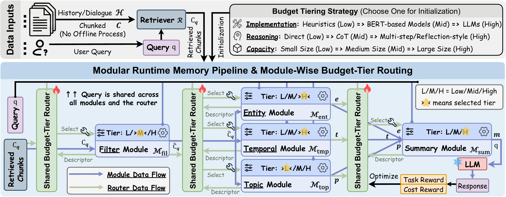

<div align="center">
  
</div>


<h1 align="center">BudgetMem: Learning Query-Aware Budget-Tier Routing for Runtime Agent Memory</h1>


<div align="center">
  <p>
    <a href='https://viktoraxelsen.github.io/BudgetMem/'></a>
    <a href='https://arxiv.org/abs/2602.06025'></a>
    <br>
    <a href="https://github.com/ViktorAxelsen/BudgetMem/stargazers"></a>
    <a href="https://github.com/ViktorAxelsen/BudgetMem/forks"></a>
    <a href="https://github.com/ViktorAxelsen/BudgetMem/issues"></a>
    <a href="https://www.python.org/downloads/release/python-3109/"></a>
    <!-- <a href="x" style="text-decoration:none;"></a> -->
    <a href="LICENSE"></a>
  </p>
</div>


## ✨ Overview

**BudgetMem** is a runtime agent memory framework that enables **explicit performance–cost control** for **on-demand memory extraction**. Instead of building a fixed memory once and using it for all future queries, BudgetMem triggers memory computation at runtime and makes it **budget-aware** through **module-level budget tiers** and **learned routing**.

At a high level, BudgetMem organizes memory extraction as a **modular pipeline**. Each module exposes three budget tiers (**Low / Mid / High**), which can be instantiated along three complementary axes:

- **Implementation tiering**: vary the module implementation (e.g., lightweight heuristics → task-specific models → LLM-based processing)
- **Reasoning tiering**: vary inference behavior (e.g., direct → CoT → multi-step/reflection)
- **Capacity tiering**: vary model capacity (e.g., small → medium → large LLM backbones)

A lightweight **budget-tier router** selects tiers module-wise based on the query and intermediate states, and is trained with **reinforcement learning** under a cost-aware objective to provide **controllable performance–cost behavior**.

BudgetMem is designed as a unified testbed to study how different tiering strategies translate compute into downstream gains. We evaluate BudgetMem on **LoCoMo**, **LongMemEval**, and **HotpotQA**, demonstrating strong performance in performance-first settings and clear performance–cost frontiers under tighter budgets.


<div align="center">
  
</div>


## 📰 News

- 🚀 **[2026-02]**: **BudgetMem** is officially released — a runtime agent memory framework that enables **explicit performance–cost control** via **module-level budget tiers** and **learned budget-tier routing**, supporting controllable on-demand memory extraction across diverse benchmarks ✨. **Stay tuned! More detailed instruction updates coming soon.**


## 🔗 Links

- [Overview](#-overview)
- [News](#-news)
- [Get Started](#-get-started)
- [Installation](#installation)
- [Preparing Training Data](#-preparing-training-data)
- [Experiments](#-experiments)
- [Training](#️-training)
- [Evaluation](#-evaluation)
- [Acknowledgments](#-acknowledgments)
- [Citation](#citation)


## 🚀 Get Started

### Installation

#### Option 1: Using uv (Recommended)

```bash
# Clone the repository
git clone https://github.com/ViktorAxelsen/BudgetMem
cd BudgetMem

# Install uv if not already installed
# See: https://docs.astral.sh/uv/getting-started/installation/

# Create virtual environment and install dependencies
uv sync

# Activate the virtual environment
source .venv/bin/activate

# Run scripts with uv
uv run python train/train_locomo.py --help
```

#### Option 2: Using Conda

```bash
# Clone the repository
git clone https://github.com/ViktorAxelsen/BudgetMem
cd BudgetMem

# Create and activate virtual environment
conda create -n budgetmem python=3.10
conda activate budgetmem

# Install dependencies
pip install -r requirements.txt
```


### 📊 Preparing Training Data

BudgetMem builds training and evaluation data from the datasets below. Please download data from the official sources and place them under `data/`. Unless otherwise noted, splits are handled by our codebase.

#### **1) LoCoMo**
- Download LoCoMo from the official repo: [LoCoMo](https://github.com/snap-research/locomo)  
- Put the downloaded file under:
  - `data/locomo10.json`
<!-- - **More instructions (splits / preprocessing) will be added here.** -->

#### **2) LongMemEval**
- Download LongMemEval from the official repo: [LongMemEval](https://github.com/xiaowu0162/LongMemEval)  
- Put the processed file under:
  - `data/longmemeval_s_cleaned.json`
- Use our split file:
  - `data/longmemeval_s_splits.json` (train/val/test)

#### **3) HotpotQA**
- Download HotpotQA from: [HotpotQA-Modified](https://huggingface.co/datasets/BytedTsinghua-SIA/hotpotqa/tree/main) (Source: [HotpotQA](https://hotpotqa.github.io/))
<!-- - We construct a training set by randomly sampling **7K** examples from the full training data (~32K) and place it under:
  - `data/xxxxx.json`   -->
- For evaluation, we use the test file:
  - `data/eval_200.json`

<!-- ❗ **Extending to more datasets and runtime pipelines.** BudgetMem is designed to be easy to extend: you can plug in new datasets by defining (i) the data loader and evaluation protocol, and (ii) the module set along with their **Low/Mid/High budget-tier implementations** under a chosen tiering strategy (implementation / reasoning / capacity). See [Extending to New Datasets and Pipelines](#-extending-to-new-datasets-and-pipelines) for step-by-step instructions. -->


## 🧪 Experiments


### 🖥️ Training

1. **Configure API keys and credentials**: Set up your API keys and credentials in the training scripts (`scripts/train_*.sh`) or via environment variables:
   - **API keys**: Configure API KEYS in `src/config.py`
   - **Hugging Face token**: Set `HF_TOKEN` or `HUGGINGFACE_TOKEN` environment variable
   - **Wandb** (optional): Set `WANDB_API_KEY` for experiment tracking, or set `WANDB_DISABLE=true` to disable

2. **Configure GPU device** (if using GPU): Set `CUDA_VISIBLE_DEVICES` in the training scripts to specify which GPU to use:
   ```bash
   export CUDA_VISIBLE_DEVICES=0  # Use GPU 0
   ```

3. **Set data paths**: Update the data file paths in the training scripts:
   - `scripts/train_locomo.sh` for LoCoMo dataset
   - `scripts/train_longmemeval.sh` for LongMemEval dataset
   - `scripts/train_hotpotqa.sh` for HotpotQA dataset

4. **Run training**: Execute the corresponding script for your dataset:
   ```bash
   bash scripts/train_locomo.sh      # For LoCoMo
   bash scripts/train_longmemeval.sh # For LongMemEval
   bash scripts/train_hotpotqa.sh    # For HotpotQA
   ```

   You can customize training parameters (model, cost strategy, reward/cost weights, etc.) directly in the script files.

5. **Training outputs**: After training completes, the script automatically evaluates both the best model and the last epoch model on the test set. Model checkpoints are saved in:
   - Best model: `./test_model/best_model_{cost_strategy}.pt`
   - Epoch checkpoints: `./test_model/checkpoint_epoch_{epoch}_{cost_strategy}.pt`
   - Evaluation results and API statistics are saved in the same directory

   **Note**: For `rule_llm` cost strategy, preprocessed memory pools are cached to disk for faster subsequent runs.

### 🧭 Evaluation

**Automatic evaluation**: Training scripts automatically evaluate models on the test set after training completes.

**Manual evaluation**: To evaluate a trained model separately, use the test utilities in the `tests/` directory. Each dataset has a corresponding test module:

- **LoCoMo**: `tests/test_utils.py` → `test_on_test_set()`
- **LongMemEval**: `tests/test_utils_longmemeval.py` → `test_on_test_set()`
- **HotpotQA**: `tests/test_utils_hotpotqa.py` → `test_on_test_set()`

The test functions require the same arguments as training (tokenizers, encoders, modules, etc.) and accept a `model_path` parameter to specify the checkpoint. You can also set the model path via `--model-path` argument or `MODEL_PATH` environment variable when calling the test functions.

**Example**: To test a specific checkpoint, modify the test script to load your model and call `test_on_test_set()` with the appropriate `model_path` pointing to your checkpoint file (e.g., `./test_model/best_model_rule_llm.pt`).


<!-- ## 🔧 Extending to New Datasets and Pipelines -->


## 🙏 Acknowledgments

We thank the authors and maintainers of **[LoCoMo](https://github.com/snap-research/locomo)**, **[LongMemEval](https://github.com/xiaowu0162/LongMemEval)**, and **[HotpotQA-Modified](https://huggingface.co/datasets/BytedTsinghua-SIA/hotpotqa/tree/main)** (source: **[HotpotQA](https://hotpotqa.github.io/)**) for releasing their datasets, evaluation protocols, and supporting code. Their efforts in building and open-sourcing high-quality benchmarks make it possible to develop, evaluate, and reproduce research on agent memory.

We also thank **[LightMem](https://github.com/zjunlp/LightMem)** for pioneering performance–efficiency considerations in memory systems, which helped motivate our focus on explicit budget control, and **[GAM](https://github.com/VectorSpaceLab/general-agentic-memory)** for advancing runtime agent memory frameworks.


## Citation

```bibtex
@article{BudgetMem,
  title={Learning Query-Aware Budget-Tier Routing for Runtime Agent Memory},
  author={Haozhen Zhang and Haodong Yue and Tao Feng and Quanyu Long and Jianzhu Bao and Bowen Jin and Weizhi Zhang and Xiao Li and Jiaxuan You and Chengwei Qin and Wenya Wang},
  journal={arXiv preprint arXiv:2602.06025},
  year={2026}
}
```
